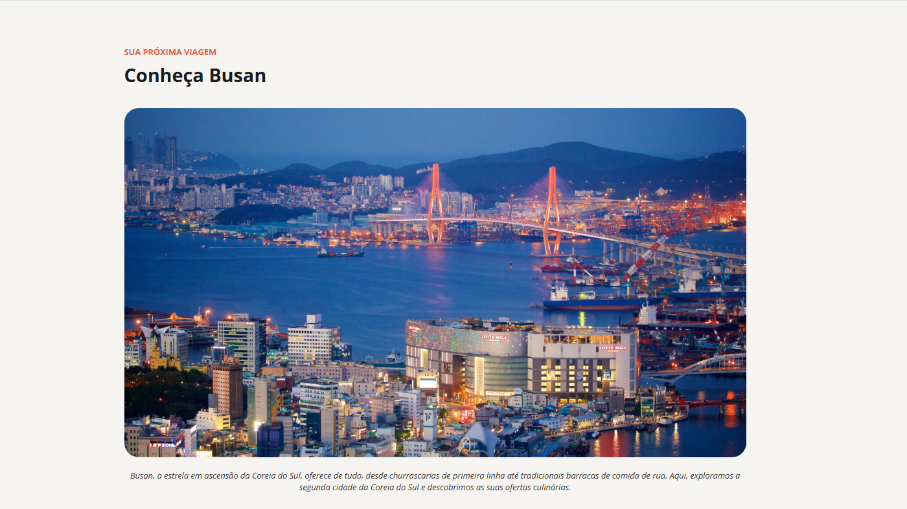

# Local Turístico: Conheça Busan

O Local Turístico é uma página que apresenta três destinos imperdíveis da cidade de Busan, na Coreia do Sul.

Este projeto foi desenvolvido como desafio prático da formação Full-Stack da Rocketseat, com o objetivo de praticar os fundamentos de HTML5 e CSS3, explorando estrutura semântica, estilização e organização de conteúdo.

[🔗 Clique aqui para acessar](https://jessicasfranca.github.io/projeto-local-turistico/)

## Sobre o Projeto

Durante o desenvolvimento, foram aplicados os seguintes conceitos:

- **HTML5**: estrutura semântica para organização do conteúdo
- **CSS3**: estilização da página, tipografia, espaçamentos e cores
- **Boas práticas**: separação entre estrutura e estilo, organização do código e legibilidade

### Funcionalidades

- Página com apresentação de três pontos turísticos de Busan
- Layout limpo e organizado
- Hierarquia visual para facilitar a leitura das informações
- Estrutura semântica utilizando elementos como `header`, `main` e `footer`

## Tecnologias Utilizadas

- HTML5
- CSS3
- Git
- GitHub

---

Desenvolvido por [Jessica França](https://github.com/jessicasfranca).
